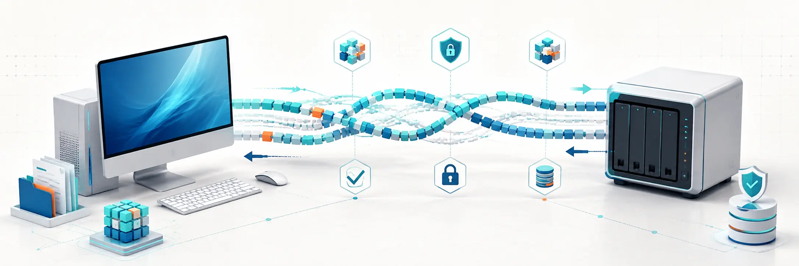

# DeltaWeave

[](https://github.com/happyaspic-byte/DeltaWeave/actions/workflows/ci.yml)
[](https://github.com/happyaspic-byte/DeltaWeave/actions/workflows/security.yml)
[](LICENSE)



DeltaWeave is a Rust foundation for authenticated, content-defined P2P file
synchronization. It combines an authoritative local filesystem index, FastCDC
chunking, BLAKE3 integrity, a durable content-addressed store, and iroh's
encrypted QUIC transport.

> **Project status: pre-alpha field preview.** v0.3 connects the persistent
> index to deterministic Merkle reconciliation, version-vector conflicts, and
> verified two-way folder synchronization. Windows/Synology hardware soak,
> installers/services, symlink materialization, and on-demand VFS are still
> incomplete. Do not use DeltaWeave as the only copy of important data.

## Actual usage

This GIF reconstructs the actual peer-accept logs and JSON result from the
v0.2.0 Windows release job in a readable terminal. It shows package verification
as **before → during → after → result**.


The [verified usage gallery](docs/USAGE_GALLERY.md) includes full-size frames,
the local-index lifecycle, and the Synology ARM64 result. Only the terminal font
and background are normalized; status values, byte counts, and event counts come
from verified executions.

The next animation is a separate, actual `sync-once` run: two independent roots
exchange files, preserve simultaneous edits, propagate a deletion, and finish
with a one-node/no-action Merkle fast path.


## What works today

| Capability | v0.3 status |
| --- | --- |
| Streaming FastCDC manifests | Implemented and unit-tested |
| Chunk and whole-file BLAKE3 verification | Implemented and unit-tested |
| Durable chunk CAS + redb metadata | Implemented with restart tests |
| Authenticated iroh/QUIC transfer | Implemented with local P2P integration tests |
| Missing-chunk-only re-transfer | Implemented with insertion/reuse tests |
| Allow-listed peer authorization | Implemented; deny by default |
| Safe replacement and recovery journal | Implemented baseline; old content goes to private trash |
| Persistent local file/directory index | Implemented with restart and operation-storm tests |
| Native watching and adaptive debounce | Implemented with full-rescan and polling fallbacks |
| Rename correlation and deletion tombstones | Implemented using stable OS identity where available |
| Case/Unicode collision detection | Implemented; collisions are reported without overwriting names |
| Locked/mutating file retry queue | Implemented with persistent exponential backoff |
| Distributed Merkle reconciliation | Implemented with partial-subtree queries and final-root verification |
| Bidirectional folder create/update/delete/rename | Implemented; rename is causal delete/create with chunk reuse |
| Version-vector conflict handling | Implemented; deterministic winner and portable conflict copy preserve both file contents |
| Partition/restart convergence | Implemented in three-peer model and two-peer restart integration tests |
| Continuous retrying synchronization | Implemented via `sync`, with bounded exponential backoff |
| Supervised daemon and authenticated local IPC | Implemented via `daemon`/`ctl`; Unix socket or Windows loopback |
| Symlink/special-file materialization | Safely rejected; indexed but not followed |
| Windows CFAPI / Linux FUSE on-demand files | Planned |

The scope and acceptance gates for later phases live in [ROADMAP.md](ROADMAP.md).

## Repository layout

| Crate | Responsibility |
| --- | --- |
| `deltaweave-core` | Stable hashes, manifests, portable paths, and version vectors |
| `deltaweave-cdc` | Streaming FastCDC, BLAKE3 manifests, and delta planning |
| `deltaweave-index` | Authoritative scans, watcher hints, collision checks, tombstones, and retries |
| `deltaweave-reconcile` | Canonical Merkle trees, causal merge, conflicts, and apply planning |
| `deltaweave-store` | Verified chunk storage, redb metadata, journaled materialization |
| `deltaweave-net` | iroh identity, authorization, Merkle queries, and causal push/pull protocols |
| `deltaweave-sync` | Retry-safe two-peer orchestration and independent convergence verification |
| `deltaweave-daemon` | Supervised sync loop, single-instance lock, and authenticated local IPC |
| `deltaweave` | JSON CLI for identity, indexing, serving, syncing, daemon control, and self-test |

See [docs/ARCHITECTURE.md](docs/ARCHITECTURE.md) and
[docs/PROTOCOL.md](docs/PROTOCOL.md) for the invariants behind these boundaries.
Daemon and service operations are documented in [docs/DAEMON.md](docs/DAEMON.md).

## Download a test release

The pre-alpha [v0.3.0 release](https://github.com/happyaspic-byte/DeltaWeave/releases/tag/v0.3.0)
provides ready-to-run packages for:

- Windows x86-64
- Synology DSM on x86-64
- Synology DSM on ARM64 (`aarch64`)

Each package includes the executable, license, cross-device test guide, and
local-index test guide. After extracting the correct package, run the isolated
end-to-end check:

```bash
deltaweave self-test
```

It performs encrypted delta transfers and additionally verifies bidirectional
exchange, deterministic conflict copies, deletion propagation, local indexing,
rename correlation, tombstones, and zero-action restart recovery. See
[Windows PC ↔ Synology testing](docs/TESTING_WINDOWS_SYNOLOGY.md) for the full
cross-device procedure and checksum verification.

For a Portainer-managed Synology receiver, an AI operator can follow the
guardrailed [AI Portainer setup runbook](docs/AI_PORTAINER_SETUP.md). The
repository includes a hardened Stack definition and CI-tested multi-architecture
container image for `linux/amd64` and `linux/arm64`.

## Build and test

DeltaWeave currently pins Rust 1.91.

```bash
cargo build --workspace
cargo test --workspace --all-targets
cargo clippy --workspace --all-targets --all-features -- -D warnings
cargo fmt --all -- --check
```

CI repeats the quality gates on Linux and runs the full test suite on Windows.
Run the same release-oriented checks locally with `./scripts/verify-release.sh`.
The evidence, deductions, and scoped **90.1/100** score are recorded in the
[v0.3 quality report](docs/QUALITY_REPORT_V0.3.md).

## Index or watch a folder

Run one authoritative scan. Keep private state and the node identity outside the
indexed root when practical; paths beneath the root are excluded automatically.

```bash
deltaweave scan \
  --root ./sync-root \
  --state ./private/index.redb \
  --identity ./private/node.key
```

For continuous local indexing, native events are debounced and treated as hints.
Periodic complete scans remain authoritative; watcher loss activates a short
polling fallback.

```bash
deltaweave watch \
  --root ./sync-root \
  --state ./private/index.redb \
  --identity ./private/node.key
```

Both commands emit JSON reports containing changes, retries, and cross-platform
name collisions. Add `--include-records` to `scan` when an operator needs the
complete persistent record and retry lists. See
[local-index testing](docs/TESTING_LOCAL_INDEX.md) for safe validation steps.

## Try a direct local transfer

Build the CLI and create a persistent identity on each node:

```bash
cargo build --release
deltaweave init --identity receiver.key
deltaweave init --identity sender.key
```

Start the receiver with the sender's printed endpoint ID. Authorization is
mandatory unless the explicitly unsafe testing flag is supplied.

```bash
deltaweave serve \
  --root ./received \
  --state ./receiver-state \
  --identity receiver.key \
  --allow-peer <SENDER_ENDPOINT_ID> \
  --direct-only
```

Copy the receiver's `endpoint_id` and one `direct_addresses` value from its JSON
output, then push a file:

```bash
deltaweave push ./large-file.bin \
  --remote-path archive/large-file.bin \
  --peer <RECEIVER_ENDPOINT_ID> \
  --direct <RECEIVER_IP:PORT> \
  --identity sender.key \
  --direct-only
```

Run the command again after editing the source. The receiver requests only
unique chunks not already present and returns a JSON receipt with transferred
bytes and reused extents.

Internet mode uses iroh discovery and encrypted relay fallback. Omit
`--direct-only`, and supply the relay URLs printed by the receiver when needed.

## Synchronize a Windows folder with Synology

Keep the Synology `serve` command running with the Windows endpoint ID on its
allow-list. On Windows, use the receiver values printed by `serve`:

```powershell
.\deltaweave.exe sync-once `
  --root C:\DeltaWeave-Sync `
  --state C:\DeltaWeave-Private\state `
  --identity C:\DeltaWeave-Private\windows.key `
  --peer <SYNOLOGY_ENDPOINT_ID> `
  --direct <SYNOLOGY_IP:UDP_PORT> `
  --direct-only
```

`sync-once` returns success only after fresh local and remote snapshots have the
same deterministic Merkle root. Use `sync` with the same arguments for continuous
operation: native local events trigger a pass after the default 750 ms quiet
window, while a five-second poll discovers remote-only changes. Watcher startup
failure falls back to polling, and transient failures retry with exponential backoff.
Every pass refuses incomplete scans, retry-queued files, cross-platform name
collisions, stale causal writes, and concurrent records that have not first
gone through deterministic reconciliation.

## Run as a local daemon

`sync` remains the foreground continuous mode. `daemon` wraps the same
reconciliation loop behind an authenticated local control plane. The CLI only
parses configuration and prints JSON; the loop, lock, and IPC live in
`deltaweave-daemon`.

```bash
deltaweave daemon \
  --root /srv/sync \
  --state /var/lib/deltaweave/sync \
  --identity /var/lib/deltaweave/identity.key \
  --peer <PEER_ENDPOINT_ID> \
  --control-state /var/lib/deltaweave/control
```

Control the running instance from the same owner account:

```bash
deltaweave ctl --control-state /var/lib/deltaweave/control status
deltaweave ctl --control-state /var/lib/deltaweave/control pause
deltaweave ctl --control-state /var/lib/deltaweave/control resume
deltaweave ctl --control-state /var/lib/deltaweave/control stop
```

IPC is local and owner-authenticated. On Unix the daemon binds `control.sock`
at mode `0600` and stores a 32-byte owner token in `owner.token` (also `0600`).
On Windows it binds loopback TCP and writes the address to `control.sock`; the
bearer token remains the secret. Frames are length-prefixed JSON with a hard
size cap. A create-new PID lock refuses a second instance and recovers a stale
PID only after the process is confirmed gone.

Print a hardened systemd unit from absolute paths (the command does not install
it):

```bash
deltaweave service systemd-unit \
  --executable /usr/local/bin/deltaweave \
  --user deltaweave \
  --root /srv/sync \
  --state /var/lib/deltaweave/sync \
  --identity /var/lib/deltaweave/identity.key \
  --peer <PEER_ENDPOINT_ID> \
  --control-state /var/lib/deltaweave/control
```

The unit enables `NoNewPrivileges`, strict system protection, read-only home,
private temporary files, explicit writable paths, and failure restart. Paths
with spaces are quoted. A home-directory sync root needs a systemd override.

On Windows, `deltaweave service run` is the SCM entry point, not an installer.
Register it separately after placing the executable, for example:

```text
sc.exe create DeltaWeave binPath= "C:\DeltaWeave\deltaweave.exe service run --root C:\Sync --state C:\DeltaWeave-Private\state --identity C:\DeltaWeave-Private\windows.key --peer <PEER> --control-state C:\DeltaWeave-Private\control" start= auto
```

Keep `--control-state` owner-only; copying it leaks the bearer token. `ctl`
never creates a token. This baseline does not provide a full Windows Service
installer or claim SCM recovery configuration.

## Security model

- iroh authenticates endpoints cryptographically and encrypts transport traffic.
- DeltaWeave independently authorizes the remote endpoint ID.
- Every received chunk and reconstructed file is verified before commit.
- Wire paths reject traversal, absolute paths, Windows device names, and invalid
  deserialized values.
- Existing content is preserved in state trash before replacement.
- Incoming state must causally dominate the installed record; stale, concurrent,
  and equal-clock/different-state writes are rejected.

This baseline does not yet defend perfectly against a privileged or racing local
attacker and does not materialize links or special files. Read
[docs/THREAT_MODEL.md](docs/THREAT_MODEL.md) before exposing a receiver or using
real data. Report vulnerabilities according to
[SECURITY.md](SECURITY.md).

## License

DeltaWeave is licensed under the [MIT License](LICENSE).
