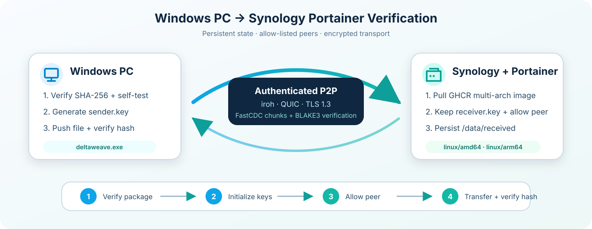

# DeltaWeave Synology Portainer AI 설치 실행서

이 문서는 **AI 운영 에이전트가 읽고 Synology NAS의 Portainer에 DeltaWeave
수신기를 안전하게 배포·검증하기 위한 실행 계약(runbook)**이다. 사람에게 일반적인
Docker 사용법을 설명하는 문서가 아니다. 에이전트는 추측으로 값을 만들지 말고 아래
게이트를 순서대로 통과해야 한다.

> **현재 범위:** DeltaWeave v0.2는 단일 파일 QUIC 델타 전송과 영속 로컬
> 폴더 인덱스/감시를 제공하는 pre-alpha다. 인덱스가 아직 자동 양방향 전송,
> 충돌 해결, DSM SPK 또는 VFS와 연결되지는 않는다. 중요한 데이터의 유일한
> 사본으로 사용하지 않는다.



실제 Windows·Synology·watcher 출력은
[실제 사용 화면 갤러리](USAGE_GALLERY.md)에서 전·중·후·결과 순서로 확인한다.

## 1. 에이전트의 완료 조건

다음 항목을 모두 증거와 함께 보고해야 설치 완료로 간주한다.

1. NAS가 `x86_64` 또는 `aarch64`이고 Docker Standalone 환경임을 확인했다.
2. Windows와 컨테이너 이미지의 `self-test`가 모두 `"status": "pass"`다.
3. Portainer Stack의 `deltaweave-receiver`가 재시작 정책과 영속 경로를 사용해 실행 중이다.
4. 로그에 `"status": "ready"`, 고정된 `endpoint_id`, 하나 이상의
   `direct_addresses`가 출력된다.
5. Windows에서 NAS로 시험 파일을 보낸 뒤 양쪽 SHA-256이 같다.
6. 파일을 조금 수정해 다시 보냈을 때 `reused_extents > 0`이고
   `transferred_bytes < 전체 파일 크기`다.
7. 컨테이너가 privileged 모드, Docker 소켓 마운트 또는 `--allow-any-authenticated`를
   사용하지 않는다.
8. 수신 폴더의 `scan` 결과가 전송한 파일을 포함하고, 컨테이너 재시작 뒤에도 index
   레코드와 generation이 유지된다.

## 2. 절대 준수할 안전 규칙

- Portainer URL, API 키, GitHub PAT, DeltaWeave `*.key`의 내용을 출력·커밋·채팅 전송하지 않는다.
- 기존 `/volume1/docker/deltaweave`를 삭제하거나 초기화하지 않는다.
- `/data/config/receiver.key`가 바뀌면 NAS endpoint ID도 바뀌므로 업데이트 때 보존한다.
- Stack 파일의 `cap_drop: ALL`, `no-new-privileges`, `read_only`, 비-root UID/GID를 제거하지 않는다.
- `DELTAWEAVE_ALLOWED_PEER`에는 사용자가 확인한 Windows sender endpoint ID만 넣는다.
- Portainer와 DeltaWeave를 인터넷에 직접 노출하지 않는다. LAN 또는 Tailscale 경로를 사용한다.
- 지원되지 않는 CPU, Swarm/Kubernetes, 권한 부족, 해시 불일치가 나오면 우회하지 말고 중단해 보고한다.

## 3. 필요한 입력과 자동 탐색

에이전트는 먼저 가능한 값을 읽기 전용으로 탐색하고, 찾을 수 없는 필수값만 사용자에게
질문한다.

| 변수 | 예시 | 획득 방법 |
| --- | --- | --- |
| `PORTAINER_URL` | `https://nas.example:9443` | 사용자 또는 기존 연결 설정 |
| Portainer 인증 | API key 권장 | 비밀 저장소/사용자 제공; 로그 금지 |
| `DELTAWEAVE_ALLOWED_PEER` | 64자 endpoint ID | Windows의 `init` JSON 출력 |
| `DELTAWEAVE_DATA_DIR` | `/volume1/docker/deltaweave` | NAS 볼륨 확인 후 결정 |
| `PUID`, `PGID` | `1026`, `100` | 해당 데이터 디렉터리 소유 계정의 `id` 결과 |
| NAS 접속 주소 | LAN 또는 Tailscale IP | `direct_addresses`와 실제 라우팅 비교 |

## 4. 사전 점검

NAS SSH 권한이 있으면 다음을 실행한다. 읽기 전용 명령부터 실행하고 출력에 비밀값이
없는지 확인한다.

```bash
uname -m
docker info --format '{{.OSType}}/{{.Architecture}} {{.ServerVersion}}'
docker compose version
df -h /volume1
```

허용 CPU는 `x86_64`와 `aarch64`뿐이다. Portainer의 대상 Environment가 이 NAS의
**Docker Standalone**인지도 확인한다. Git 기반 Stack은 이미 빌드된 이미지를 참조해야
하며 Portainer에서 저장소의 Dockerfile을 즉석 빌드하려고 시도하지 않는다.

Windows PowerShell에서 릴리즈 바이너리를 먼저 검증한다.

```powershell
cd C:\DeltaWeave
.\deltaweave.exe self-test
.\deltaweave.exe init --identity .\data\sender.key
```

`self-test`의 `status`가 `pass`인지 확인하고 `init` JSON의 `endpoint_id`만
`DELTAWEAVE_ALLOWED_PEER`로 기록한다. `sender.key` 내용은 읽거나 전송하지 않는다.


## 5. NAS 영속 디렉터리 준비

NAS에서 DeltaWeave를 소유할 기존 DSM 계정을 선택한다. 숫자 UID/GID를 확인한 뒤
디렉터리를 만든다. `<DSM_USER>`를 실제 계정명으로 교체한다.

```bash
PUID_VALUE="$(id -u <DSM_USER>)"
PGID_VALUE="$(id -g <DSM_USER>)"
sudo install -d -m 0700 -o "$PUID_VALUE" -g "$PGID_VALUE" \
  /volume1/docker/deltaweave \
  /volume1/docker/deltaweave/config \
  /volume1/docker/deltaweave/index \
  /volume1/docker/deltaweave/received \
  /volume1/docker/deltaweave/state
```

위 값을 Portainer 환경변수 `PUID`, `PGID`로 사용한다. 경로가 이미 존재한다면
소유권과 내용부터 확인하며 재귀 `chown`, 삭제 또는 덮어쓰기를 자동 실행하지 않는다.

## 6. 컨테이너 이미지 확인

기본 이미지는 다음 멀티아키텍처 이미지다.

```text
ghcr.io/happyaspic-byte/deltaweave:main
```

공개 pull이 거부될 때만 Portainer의 **Registries**에 `ghcr.io`를 추가한다. GitHub
사용자명과 최소 `read:packages` 권한의 PAT를 사용하고 토큰을 Stack 환경변수나 Compose
파일에 넣지 않는다. 인증 수단이 없으면 에이전트는 사용자에게 요청하고 중단한다.

배포 전에 NAS에서 이미지를 독립 검증할 수 있다.

```bash
docker pull ghcr.io/happyaspic-byte/deltaweave:main
docker run --rm ghcr.io/happyaspic-byte/deltaweave:main self-test
```

반드시 `"status": "pass"`를 확인한다. NAS CPU에 맞는 이미지가 manifest에서 자동 선택된다.


## 7. Portainer Stack 배포

Portainer에서 다음 값으로 Git repository Stack을 생성한다.

| 항목 | 값 |
| --- | --- |
| Name | `deltaweave` |
| Repository URL | `https://github.com/happyaspic-byte/DeltaWeave` |
| Repository reference | `refs/heads/main` |
| Compose path | `deploy/portainer/compose.yml` |

Stack 환경변수는 다음 네 개를 설정한다.

```dotenv
DELTAWEAVE_ALLOWED_PEER=<WINDOWS_INIT에서_얻은_ENDPOINT_ID>
DELTAWEAVE_DATA_DIR=/volume1/docker/deltaweave
PUID=<DSM_ACCOUNT_UID>
PGID=<DSM_ACCOUNT_GID>
```

선택 변수:

```dotenv
DELTAWEAVE_IMAGE=ghcr.io/happyaspic-byte/deltaweave:main
DELTAWEAVE_LOG_LEVEL=info
```

Portainer API/MCP를 사용할 수 있으면 동일한 값으로 Git Stack을 생성해도 된다. 단,
인증 오류를 무시하거나 비밀값을 응답 본문에 노출하지 않는다. API가 없으면 Portainer
UI에서 **Stacks → Add stack → Git repository → Deploy the stack** 순서로 진행한다.

## 8. 배포 직후 검증

Portainer의 Container 상태와 로그를 확인한다. 정상 시작 로그는 다음 형태다.

```json
{
  "status": "ready",
  "endpoint_id": "<SYNOLOGY_ENDPOINT_ID>",
  "direct_addresses": ["<NAS_IP:UDP_PORT>"],
  "relay_urls": []
}
```

실제 NAS LAN 또는 Tailscale IP가 포함된 `IP:UDP_PORT`를 선택한다. DSM 방화벽이
활성화되어 있으면 그 UDP 포트를 Windows 원본 주소에서만 허용한다. 컨테이너는 host
network를 사용하므로 Compose에 port mapping을 추가하지 않는다.

컨테이너를 한 번 재시작하고 `endpoint_id`가 동일한지 확인한다. 달라졌다면 `/data`
마운트 또는 쓰기 권한 문제이므로 파일 전송 전에 수정한다.

## 9. Windows에서 NAS로 종단간 시험

10 MiB 이상의 **복사본 테스트 파일**을 준비하고 아래 값을 실제 로그 출력으로 바꾼다.

```powershell
.\deltaweave.exe push C:\Test\sample.bin `
  --remote-path validation/sample.bin `
  --peer <SYNOLOGY_ENDPOINT_ID> `
  --direct <SYNOLOGY_IP:UDP_PORT> `
  --identity .\data\sender.key `
  --direct-only
```

무결성을 비교한다.

```powershell
Get-FileHash C:\Test\sample.bin -Algorithm SHA256
```

```bash
sha256sum /volume1/docker/deltaweave/received/validation/sample.bin
```

두 값이 같아야 한다. 이어서 Windows 파일에 소량을 추가하고 같은 `push`를 다시 실행한다.

```powershell
[IO.File]::AppendAllText("C:\Test\sample.bin", "DeltaWeave delta test")
```

두 번째 receipt의 `reused_extents > 0`, `transferred_bytes < 전체 파일 크기`와 변경 후
양쪽 SHA-256 일치를 확인한다.

이어서 컨테이너 안의 v0.2 로컬 인덱스로 수신 폴더를 검사한다.

```bash
docker exec deltaweave-receiver deltaweave scan \
  --root /data/received \
  --state /data/index/received.redb \
  --identity /data/config/receiver.key \
  --ignore /data/state \
  --include-records
```

`report.issues`와 `report.collisions`가 비어 있고 `records`에
`validation/sample.bin`의 live record가 포함되어야 한다. 컨테이너를 재시작하고
같은 명령을 다시 실행해
generation 증가와 레코드 유지도 확인한다. 이 검사는 자동 양방향 동기화를 켜는
명령이 아니다. 자세한 실패 판정은 [로컬 인덱스 검증서](TESTING_LOCAL_INDEX.md)를
따른다.

## 10. 업데이트, 롤백, 백업

- 업데이트: 먼저 `/volume1/docker/deltaweave`를 백업하고 새 이미지를 pull한 뒤 Stack을
  redeploy한다. **볼륨을 제거하지 않는다.**
- 롤백: 정상 동작했던 `ghcr.io/happyaspic-byte/deltaweave:sha-<COMMIT_SHA>`를
  `DELTAWEAVE_IMAGE`로 지정해 redeploy한다.
- 최소 백업 대상: `config/receiver.key`, `state/`, `received/`. `index/`는 복구
  시간을 줄이지만 원본 데이터로부터 다시 만들 수 있다.
- `main`은 pre-alpha 이동 태그다. 반복 가능한 장기 배포에는 검증한 `sha-...` 태그나
  이미지 digest를 고정한다.

## 11. AI 최종 보고 형식

비밀값과 전체 endpoint ID는 마스킹하고 다음 형식으로 보고한다.

```text
DeltaWeave Portainer 배포 결과: PASS 또는 FAIL
NAS: <model/arch>, Docker <version>, Portainer <version>
Image: <tag 또는 digest>
Container: running 여부 / restart 검증
Receiver ID: 앞 8자...뒤 4자, 재시작 후 동일 여부
Address: <LAN 또는 Tailscale IP>:<UDP port>
Self-test: status / reused_extents / transferred bytes
Cross-device: 최초 전송 PASS/FAIL, SHA-256 일치 PASS/FAIL
Delta retry: reused_extents / transferred bytes / SHA-256 일치
Local index: generation / live records / issues / restart 유지 여부
Persistence: config/state/received 경로 및 백업 여부
남은 위험 또는 차단 사항: <없음 또는 구체적 오류>
```

문제가 생기면 [Windows PC ↔ Synology 테스트 문서](TESTING_WINDOWS_SYNOLOGY.md)의
문제 해결 표도 함께 확인한다.
