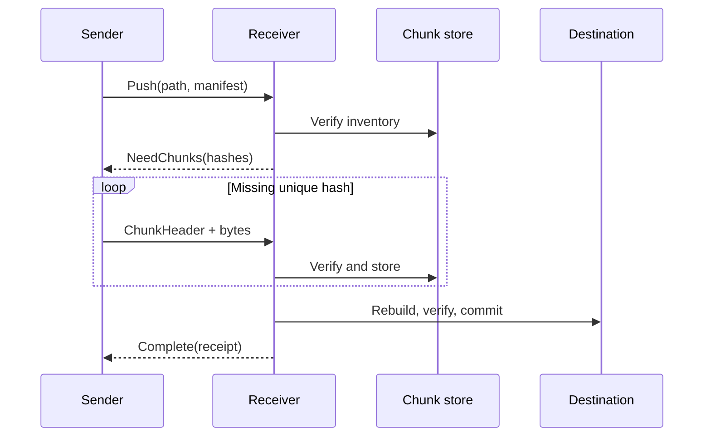

# DeltaWeave Transfer and Reconciliation Protocols

This document describes the pre-alpha one-file push (v1) and reconciliation (v2)
protocols implemented by [`deltaweave-net`](../crates/deltaweave-net/src/lib.rs).
The serde types there define the wire messages; shared manifests, paths, hashes,
and causal records are defined in
[`deltaweave-core`](../crates/deltaweave-core/src/lib.rs).

## Transport and identity

- Transport: iroh QUIC with authenticated endpoint keys.
- ALPNs: `deltaweave/sync/1` for one-file push and `deltaweave/sync/2` for
  reconciliation. The receiver registers both.
- Application authorization: receiver allow-list, evaluated from the
  cryptographically authenticated remote endpoint ID before accepting a stream.
  The same policy covers both ALPNs; `--allow-any-authenticated` bypasses the list.
- Internet mode uses iroh's `N0` preset for discovery and relay fallback;
  direct-only mode uses its `Minimal` preset and supplied direct addresses.
- Current handlers accept one bidirectional stream per connection. The v1
  stream represents one file transfer; a v2 stream represents one operation or
  a complete sequence of Merkle queries. These are QUIC messages, not HTTP routes.

## Framing

Control values are serde/postcard encoded and prefixed by an unsigned 32-bit
big-endian byte length. A control frame is limited to 16 MiB. Raw chunk bytes
immediately follow their `ChunkHeader`; their exact length comes from the header
and must match the already accepted manifest.

`Hash32` serializes as a 64-character hexadecimal string, including in postcard;
it is not serialized as a raw 32-byte digest. The message names below describe
serde enum variants, not text commands or JSON objects.

The sender finishes its stream after transmitting the requested chunks. A
premature EOF while reading an expected frame or payload, malformed postcard,
an unexpected hash, or a mismatched length fails the operation. The push handlers
stop reading after the requested chunks; they do not require EOF or reject
trailing upload bytes before applying the file.

## Messages

1. `Push { path, manifest }`
2. `NeedChunks { hashes }` or `Error { message }`
3. For each requested hash, in order: `ChunkHeader { hash, length }` followed by
   exactly `length` bytes
4. `Complete(receipt)` or `Error { message }`

`TransferReceipt` contains `path`, `file_hash`, `manifest_hash`,
`transferred_bytes`, and `reused_extents`; the sender verifies all five fields.
Transferred bytes count unique requested chunk payloads, excluding framing.
Reused extents count every manifest extent whose hash was already verified in
the receiver CAS, including repeated occurrences of that hash.

`Rejected { message }` remains in the v1 response enum and client handling, but
the server does not emit it: unauthorized peers receive a connection close with
reason `endpoint ID is not allow-listed`. Other handler failures attempt an
`Error { message }` response and finish the stream. Errors are human-readable,
not stable error codes; long server messages retain at most 1,024 UTF-8 bytes
plus an ellipsis. Transport failures may prevent an error response from arriving.

V1 pushes have no causal precondition. A successful push is adopted as a new
receiver-local index event, including an identical-file retry. Use v2 for
reconciliation that must reject stale or concurrent records.

## Resource limits

| Limit or default | Value | Scope |
| --- | --- | --- |
| Control frame | 16 MiB | All v1/v2 control reads and writes |
| Chunks per manifest | 250,000 | Incoming v1 and v2 pushes |
| Logical file size | 16 TiB | Incoming v1 and v2 pushes |
| Default FastCDC min / average / max | 64 KiB / 256 KiB / 1 MiB | Default profile |
| Automatic large-file profile | 512 KiB / 1 MiB / 4 MiB | Path-based chunking of files at least 8 GiB when the default profile was requested |
| Maximum profile chunk size | 16 MiB | Manifest profile validation |
| Portable path / component | 4,096 / 255 UTF-8 bytes | `WirePath` validation |
| Snapshot record count | 1,000,000 | V2 snapshot server and client summary checks |
| Merkle queries per snapshot | 1,000,000 | V2 client query loop |

The chunking profile travels in the manifest and is validated before raw chunk
allocation, after the control frame has been decoded. Profile values must be
even and strictly increasing: min is 64 bytes–1 MiB, average is 256 bytes–4 MiB,
and max is 1 KiB–16 MiB. Individual chunks must be nonempty and no larger than
the profile maximum; validation does not enforce the profile minimum on extents.
An empty file has no chunks and the BLAKE3 digest of empty content.

The full manifest must fit in one control frame. The v2 pull path validates
manifest structure, profile, and agreement with the requested record, but does
not apply the push-specific file-size and chunk-count checks. Limits are guards,
not promises that every supported platform can materialize the maximum file;
the frame and chunk-count ceilings may constrain a transfer first.
Descriptors that repeat a content hash must also repeat its exact length; this
keeps the content-addressed lookup unambiguous before any payload is accepted.

## Versioning

Any incompatible message, hashing, framing, or semantic change requires a new
ALPN beyond the affected version. Manifest, chunking-profile, and sync-record
schemas currently use version `1`; their validators reject unknown versions.
V2 is already a separate implemented protocol, not a planned replacement name.

## Reconciliation protocol v2

ALPN `deltaweave/sync/2` reuses the authenticated endpoint allow-list, framing,
manifest validation, and chunk verification rules above. A `SyncSession` reuses
one local iroh endpoint across a reconciliation pass; each operation connects
and opens its own bidirectional stream. V2 failures use `Error { message }`,
with the same best-effort delivery and truncation behavior as v1.

### Merkle snapshot

1. Client sends `QueryNode { prefix: "" }`.
2. Receiver performs one authoritative scan and rejects the session if it has
   collisions, incomplete reads, or queued retries.
3. Receiver builds an immutable tree for this session and returns
   `Node { summary }`: prefix, node hash/cardinality, optional exact-path record,
   and ordered immediate-child summaries. A missing prefix has `summary: None`;
   the snapshot client treats that as an error.
4. Client reuses locally matching subtrees and queues only mismatched child
   prefixes. Every reconstructed record is schema/path validated.
5. Client sends `Finish`, receives `Finished`, rebuilds the complete remote tree
   locally, and rejects any root or record-count mismatch. Inconsistent duplicate
   paths are rejected; identical duplicate records are deduplicated.

Before scheduling child queries, the client checks sorted unique immediate child
names, record-prefix correspondence, positive child cardinalities, and exact
parent/child cardinality sums. Queried children must match the hash and cardinality
advertised by their parent. Queued and issued queries together are limited to
1,000,000; the same upper bound applies to snapshot records.

An unchanged namespace therefore exchanges one node summary rather than the
complete record set. That summary still contains every immediate child, so its
size depends on fan-out. Snapshot consistency is checked against the peer's own
advertised root; it does not prove that a malicious peer reported its filesystem
truthfully. Server query sessions accept only `QueryNode` and `Finish` after the
first query.

### Exact causal content operations

- `PullRecord { record }` returns `PullManifest { record, manifest }` only if the
  receiver's freshly scanned exact record still matches and the generated
  manifest agrees with its size and content hash. The client sends
  `NeedChunks { hashes }`; the server sends ordered chunk headers/payloads and
  `Applied(receipt)`. The client verifies and stores chunks without publishing
  a path. Despite its name, this pull receipt does not acknowledge a mutation.
- `PushRecord { record, manifest }` transfers missing chunks first. Under the
  receiver apply lock, a fresh scan must show that the path has no current
  record, or that the candidate causally dominates the current record (or has
  equal causal knowledge and identical state). The exchange is
  `NeedChunks { hashes }`, ordered chunk headers/payloads, then `Applied(receipt)`
  after verified materialization and exact version-vector adoption.
- `ApplyMetadata { record }` applies a live directory or tombstone under the
  same causal precondition and returns `Applied(receipt)`. Non-directory
  deletions are preserved in private trash; directories are removed only when
  empty. Metadata receipts have zero transferred bytes and reused extents.

The relation is evaluated as `current.version.relation(incoming.version)`:
`After` (stale incoming), `Concurrent`, and equal-clock/different-state
preconditions are rejected. Conflict resolution happens in the deterministic
state engine and produces a version vector that dominates both inputs before
either peer applies it. Chunk staging may already have written to CAS when a
causal check fails. These checks cover v2 mutations, not v1 pushes.

`SyncRecord` carries schema version, path, kind, size, optional complete-file
hash, readonly state, version vector, and tombstone flag. Files and directories
can be materialized; symlinks/reparse points and other special objects can be
indexed but are rejected as live synchronization targets. File timestamps,
ownership, and full permission modes are not carried by the record.

### Completion receipts

Every v2 mutation receipt binds the portable path, logical record hash, unique
payload bytes, and reused extent count. `sync-once` does not treat receipts alone
as convergence proof: it independently rescans local state and fetches a new
remote Merkle root after all actions. Both root hashes and record counts must
match the desired tree. An entire pass is not a distributed transaction: an
error can leave previously completed actions and verified chunks in place for
the next reconciliation attempt.

Receiver error responses use bounded, static recovery guidance. Internal absolute
paths and raw storage errors are not transmitted in those responses or copied into
receiver failure logs. The message schemas and ALPN identifiers are unchanged.
