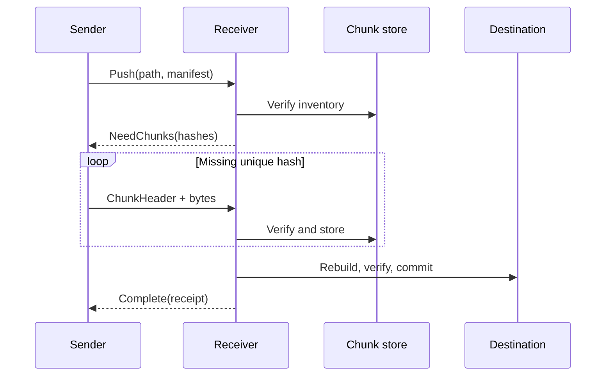

# DeltaWeave Transfer Protocol v1

This document describes the pre-alpha one-file push protocol implemented by
`deltaweave-net`. It is deliberately small and will not be changed compatibly
without a new ALPN.

## Transport and identity

- Transport: iroh QUIC with authenticated endpoint keys.
- ALPN: `deltaweave/sync/1`.
- Application authorization: receiver allow-list, evaluated from the
  cryptographically authenticated remote endpoint ID.
- One bidirectional QUIC stream represents one file transfer.

## Framing

Control values are serde/postcard encoded and prefixed by an unsigned 32-bit
big-endian byte length. A control frame is limited to 16 MiB. Raw chunk bytes
immediately follow their `ChunkHeader`; their exact length comes from the header
and must match the already accepted manifest.

The sender finishes its stream after transmitting the requested chunks. The
receiver treats premature EOF, additional data in place of a frame, malformed
postcard, an unexpected hash, or a mismatched length as a failed transfer.

## Messages

1. `Push { path, manifest }`
2. `NeedChunks { hashes }`, `Rejected { message }`, or `Error { message }`
3. For each requested hash, in order: `ChunkHeader { hash, length }` followed by
   exactly `length` bytes
4. `Complete(receipt)` or `Error { message }`

The receipt binds the destination path, complete-file hash, manifest hash,
unique payload bytes accepted in the session, and number of reused extents.

## Resource limits

| Limit | v1 value |
| --- | ---: |
| Control frame | 16 MiB |
| Chunks per manifest | 250,000 |
| Logical file size | 16 TiB |
| Default FastCDC sizes | 64 KiB / 256 KiB / 1 MiB |

The chunking profile travels in the manifest and is validated before allocation.
The full manifest must fit in one control frame. Limits are protocol guards, not
promises that every supported platform can materialize the maximum file.

## Versioning

Any incompatible message, hashing, framing, or semantic change requires a new
ALPN such as `deltaweave/sync/2`. Unknown manifest schema and chunking profile
versions are rejected rather than guessed.
