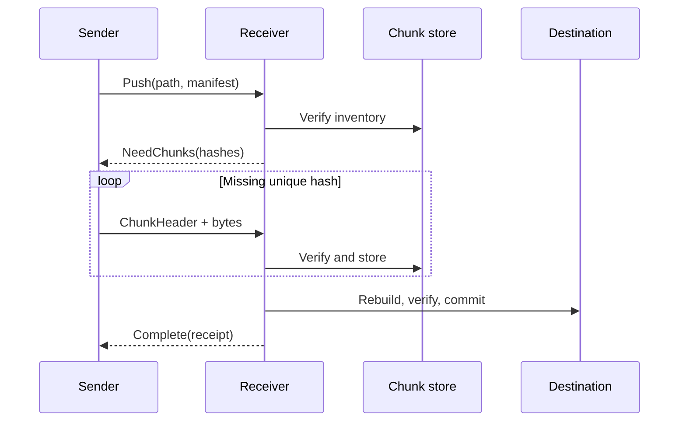

# DeltaWeave Transfer and Reconciliation Protocols

This document describes the pre-alpha one-file push protocol implemented by
`deltaweave-net`. It is deliberately small and will not be changed compatibly
without a new ALPN.

## Transport and identity

- Transport: iroh QUIC with authenticated endpoint keys.
- ALPN: `deltaweave/sync/1`.
- Application authorization: receiver allow-list, evaluated from the
  cryptographically authenticated remote endpoint ID.
- One bidirectional QUIC stream represents one file transfer.

## Framing

Control values are serde/postcard encoded and prefixed by an unsigned 32-bit
big-endian byte length. A control frame is limited to 16 MiB. Raw chunk bytes
immediately follow their `ChunkHeader`; their exact length comes from the header
and must match the already accepted manifest.

The sender finishes its stream after transmitting the requested chunks. The
receiver treats premature EOF, additional data in place of a frame, malformed
postcard, an unexpected hash, or a mismatched length as a failed transfer.

## Messages

1. `Push { path, manifest }`
2. `NeedChunks { hashes }`, `Rejected { message }`, or `Error { message }`
3. For each requested hash, in order: `ChunkHeader { hash, length }` followed by
   exactly `length` bytes
4. `Complete(receipt)` or `Error { message }`

The receipt binds the destination path, complete-file hash, manifest hash,
unique payload bytes accepted in the session, and number of reused extents.

## Resource limits

| Limit | v1 value |
| --- | ---: |
| Control frame | 16 MiB |
| Chunks per manifest | 250,000 |
| Logical file size | 16 TiB |
| Default FastCDC sizes | 64 KiB / 256 KiB / 1 MiB |

The chunking profile travels in the manifest and is validated before allocation.
The full manifest must fit in one control frame. Limits are protocol guards, not
promises that every supported platform can materialize the maximum file.
Descriptors that repeat a content hash must also repeat its exact length; this
keeps the content-addressed lookup unambiguous before any payload is accepted.

## Versioning

Any incompatible message, hashing, framing, or semantic change requires a new
ALPN such as `deltaweave/sync/2`. Unknown manifest schema and chunking profile
versions are rejected rather than guessed.

## Reconciliation protocol v2

ALPN `deltaweave/sync/2` reuses the authenticated endpoint allow-list, frame
limit, manifest validation, and chunk verification rules above. Each operation
uses one bidirectional stream; a client may reuse its local iroh endpoint across
all operations in a reconciliation pass.

### Merkle snapshot

1. Client sends `QueryNode { prefix: "" }`.
2. Receiver performs one authoritative scan and rejects the session if it has
   collisions, incomplete reads, or queued retries.
3. Receiver returns the node hash/cardinality, optional exact-path record, and
   ordered immediate-child summaries.
4. Client reuses locally matching subtrees and queues only mismatched child
   prefixes. Every reconstructed record is schema/path validated.
5. Client sends `Finish`, rebuilds the complete remote tree locally, and rejects
   any root or record-count mismatch.

An unchanged namespace therefore exchanges one node summary rather than the
complete record set.

### Exact causal content operations

- `PullRecord { record }` returns a manifest only if the receiver's freshly
  scanned exact record still matches. The client requests missing unique chunks,
  verifies each chunk, and stores them without publishing a path.
- `PushRecord { record, manifest }` transfers missing chunks first. Under the
  receiver apply lock, a fresh scan must show that the candidate causally
  dominates the current record (or is an identical idempotent retry). The file
  is then atomically materialized and the exact version vector is adopted.
- `ApplyMetadata { record }` applies a live directory or tombstone under the
  same causal precondition. Non-file deletions are preserved in private trash;
  directories are removed only when empty.

`After` (stale incoming), `Concurrent`, and equal-clock/different-state
preconditions are rejected. Conflict resolution happens in the deterministic
state engine and produces a version vector that dominates both inputs before
either peer applies it.

### Completion receipts

Every v2 mutation receipt binds the portable path, logical record hash, unique
payload bytes, and reused extent count. `sync-once` does not treat receipts alone
as convergence proof: it independently rescans local state and fetches a new
remote Merkle root after all actions.

## CAS swarm protocol v3

ALPN `deltaweave/sync/3` is a content-plane protocol. It cannot mutate paths,
version vectors, Merkle state, conflict winners, or apply order. Existing v2
reconciliation remains the state-plane authority.

The receiver evaluates the authenticated endpoint ID against the same allow-list
before accepting any stream. An authorized peer may then use:

1. `Hello { protocol_version: 3 }` → `HelloOk { protocol_version, max_inflight }`
2. `Availability { hashes }` → one exact boolean per requested hash
3. `GetChunks { hashes }` → `Chunks { present, missing }`, followed by one
   `ChunkHeader` and exact payload for each present hash

Availability is exact rather than probabilistic. `GetChunks` serves only content
already present in the local CAS; it never fetches on behalf of the requester.
Each returned payload is rehashed by the client before durable CAS admission.

### Swarm resource limits

| Limit | v3 value |
| --- | ---: |
| Sources per fill | 8 |
| Availability hashes | 4,096 |
| Chunk hashes per request | 64 |
| Scheduler assignments per pass | 64 |
| Active overlay at 1 / 10 / 100 / 1,000 peers | 1 / 6 / 8 / 12 |
| Passive overlay maximum | 64 |

The scheduler processes rarest hashes first, then minimizes peer RTT, queued-byte
cost, and failure penalty. Source selection affects throughput only; BLAKE3 and
final v2 Merkle verification remain the correctness gates.

The experimental `swarm-fill` command exposes CAS filling for benchmarking. It
requires one direct address per peer and does not publish a file into the sync
root.

`sync-once` and `sync` may optionally list up to eight authorized V3 sources
with matching `--swarm-peer` / `--swarm-direct` arguments. The authoritative
v2 peer still supplies the causal `SyncRecord` and FastCDC manifest. Missing
CAS hashes are filled from those V3 sources, then existing v2 materialization,
causal apply, and final Merkle verification run unchanged. If swarm filling
cannot complete every required hash, the client falls back to a full v2
content pull from the authoritative peer.
