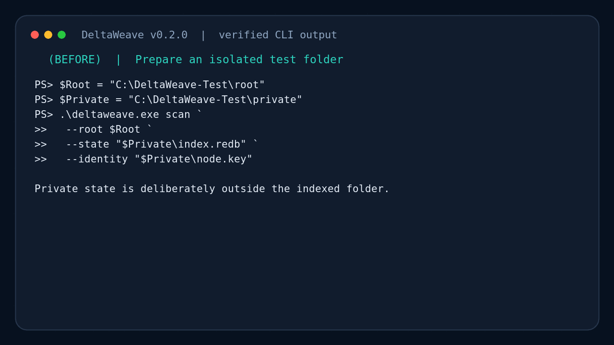

# DeltaWeave v0.2 로컬 인덱스 검증

이 문서는 Windows PC와 Synology/Linux에서 `scan`·`watch` 기능을 검증하는
절차다. v0.2의 인덱스는 로컬 변경을 안전하게 기록하지만 아직 다른 장비로 자동
전송하지 않는다. 반드시 복사본 테스트 디렉터리를 사용한다.

## 실제 실행 화면: 전·중·후·결과

아래 GIF는 실제 세 파일 스캔과 native watcher 파일 생성 이벤트를 순서대로
보여 준다. 터미널 스타일만 통일했으며 `generation`, record 수, 이벤트 수,
`issues` 값은 v0.2.0 바이너리를 직접 실행해 얻었다.



각 프레임을 확대해서 보려면 [실제 사용 화면 갤러리](USAGE_GALLERY.md)를 연다.

- 전: 시험 root와 private state를 분리한다.
- 중: 초기 스캔 후 `status=watching`을 확인한다.
- 후: 파일 생성이 `native_events`와 `watch_scan`으로 기록된다.
- 결과: authoritative scan의 `issues`, `collisions`, retry가 비어 있다.

## 합격 기준

- 최초 스캔이 파일·디렉터리 수와 `files_hashed`를 정확히 보고한다.
- 변경 없는 다음 스캔은 `changes: []`다.
- 이름 변경은 가능한 파일시스템에서 `renamed`로 상관관계가 잡힌다.
- 삭제 후 이전 경로는 사라지지 않고 tombstone으로 남는다.
- 프로세스 재시작 후 generation과 records가 유지된다.
- Windows 공유 잠금 또는 읽기 실패는 프로세스를 종료하지 않고 retry queue에 남는다.
- Linux의 대소문자/Unicode 충돌은 두 레코드를 모두 보존하고 `collisions`로 보고한다.
- `watch`는 이벤트 폭주를 debounce하며, 주기 전체 스캔을 계속 수행한다.

## Windows PowerShell

릴리스 압축을 푼 디렉터리에서 실행한다.

```powershell
$Root = "C:\DeltaWeave-Test\root"
$Private = "C:\DeltaWeave-Test\private"
New-Item -ItemType Directory -Force $Root, $Private | Out-Null
[IO.File]::WriteAllText((Join-Path $Root "before.txt"), "first version")

.\deltaweave.exe scan `
  --root $Root `
  --state (Join-Path $Private "index.redb") `
  --identity (Join-Path $Private "node.key") `
  --include-records
```

`--include-records` 결과는 `report`, `records`, `retries`를 출력한다. `report`에는
`status` 필드 대신 `generation`, `live_records`, `files_hashed`, `changes`,
`collisions`, `issues`가 있다. `report.issues`가 비어 있고
`report.live_records`와 실제 항목 수가 같아야 한다.

이름 변경과 삭제를 각각 수행한 뒤 같은 `scan`을 다시 실행한다.

```powershell
Rename-Item (Join-Path $Root "before.txt") "after.txt"
# scan 명령 재실행: changes에 kind=renamed 확인
Remove-Item (Join-Path $Root "after.txt")
# scan 명령 재실행: changes에 kind=deleted, tombstones 증가 확인
```

Windows 공유 잠금 재시도는 별도 시험 파일로 확인한다.

```powershell
$Locked = Join-Path $Root "locked.bin"
[IO.File]::WriteAllText($Locked, "locked data")
$Handle = [IO.File]::Open($Locked, 'Open', 'ReadWrite', 'None')
# 이 상태에서 scan 실행: hash_failed issue와 retries_queued 증가 확인
$Handle.Dispose()
Start-Sleep -Seconds 1
# scan 재실행: 파일 인덱싱 성공과 retries_queued 감소 확인
```

연속 감시는 다음과 같이 실행하고 다른 PowerShell 창에서 파일을 생성·수정·이름
변경한다. 기본값은 750 ms quiet window, 5초 최대 debounce, 10분 전체 검증,
watcher 장애 시 5초 폴링이다.

```powershell
.\deltaweave.exe watch `
  --root $Root `
  --state (Join-Path $Private "index.redb") `
  --identity (Join-Path $Private "node.key")
```

`watch_scan` JSON이 출력되고 `native_events`가 0보다 커야 한다. 종료는
`Ctrl+C`를 사용한다.


## Synology 또는 Linux

동기화 시험 루트와 private state를 분리한다.

```bash
mkdir -p /volume1/DeltaWeave-Test/root /volume1/DeltaWeave-Test/private
printf 'first version\n' > /volume1/DeltaWeave-Test/root/before.txt

./deltaweave scan \
  --root /volume1/DeltaWeave-Test/root \
  --state /volume1/DeltaWeave-Test/private/index.redb \
  --identity /volume1/DeltaWeave-Test/private/node.key
```

대소문자 충돌을 지원하는 파일시스템에서는 다음 두 이름을 만든 뒤 스캔한다.

```bash
printf 'upper\n' > /volume1/DeltaWeave-Test/root/Report.txt
printf 'lower\n' > /volume1/DeltaWeave-Test/root/report.txt
```

결과의 한 collision group에 두 경로가 모두 있어야 하며 `live_records`도 둘을
각각 계산해야 한다. 충돌을 자동으로 이름 변경하거나 삭제하지 않는 것이 정상이다.

연속 감시는 다음 명령으로 확인한다.

```bash
./deltaweave watch \
  --root /volume1/DeltaWeave-Test/root \
  --state /volume1/DeltaWeave-Test/private/index.redb \
  --identity /volume1/DeltaWeave-Test/private/node.key
```

Synology의 inotify 한도가 부족하면 초기 JSON의 `status`가
`polling_fallback`이고 `watcher_error`가 원인을 설명한다. 이 경우에도 5초마다
`fallback_scan`이 출력되어야 한다.

## Portainer 컨테이너에서 받은 파일 검사

수신 컨테이너가 실행 중이면 별도 프로세스로 `/data/received`를 한 번 검사할 수 있다.

```bash
docker exec deltaweave-receiver deltaweave scan \
  --root /data/received \
  --state /data/index/received.redb \
  --identity /data/config/receiver.key \
  --ignore /data/state \
  --include-records
```

컨테이너 재시작 후 같은 명령을 실행해 generation이 증가하고 기존 레코드가 유지되는지
확인한다. `/data/index`는 바인드 마운트 안에 있으므로 영속하지만 재구축 가능한
메타데이터다.

## 실패 보고에 포함할 내용

- OS/DSM 버전과 CPU 아키텍처
- DeltaWeave 버전 및 패키지 SHA-256
- 실행 명령(키 내용 제외)
- 전체 `ScanReport` JSON과 관련 로그
- 실제 디렉터리 트리, 기대한 change, 실제 change
- 재시작 전후 generation 및 retry 수

실패했다고 테스트 데이터를 삭제하거나 index DB를 초기화하지 않는다. DB와 최소 재현
디렉터리의 복사본을 보존한 뒤 이슈에 비밀값과 실제 사용자 파일이 포함되지 않았는지
확인한다.
