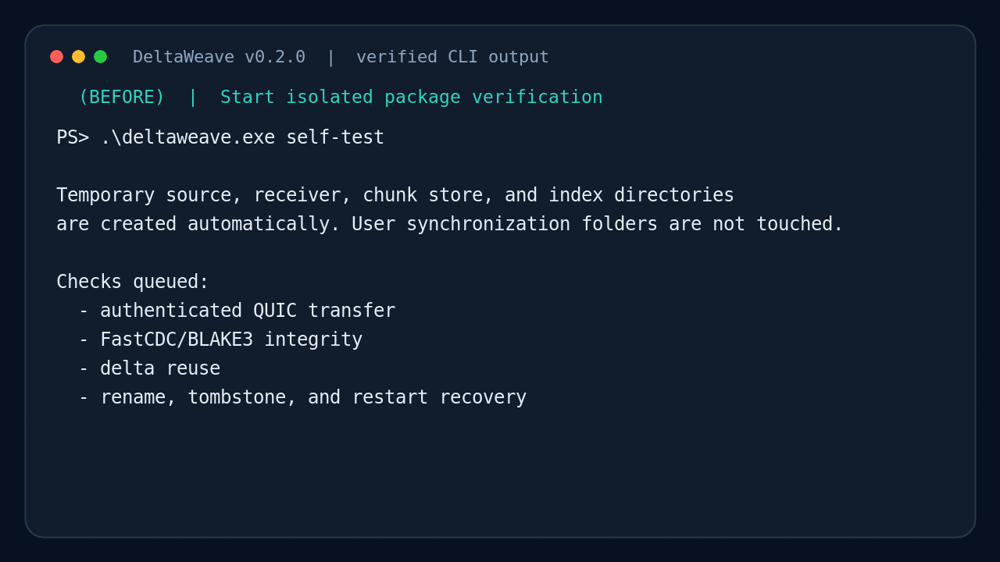
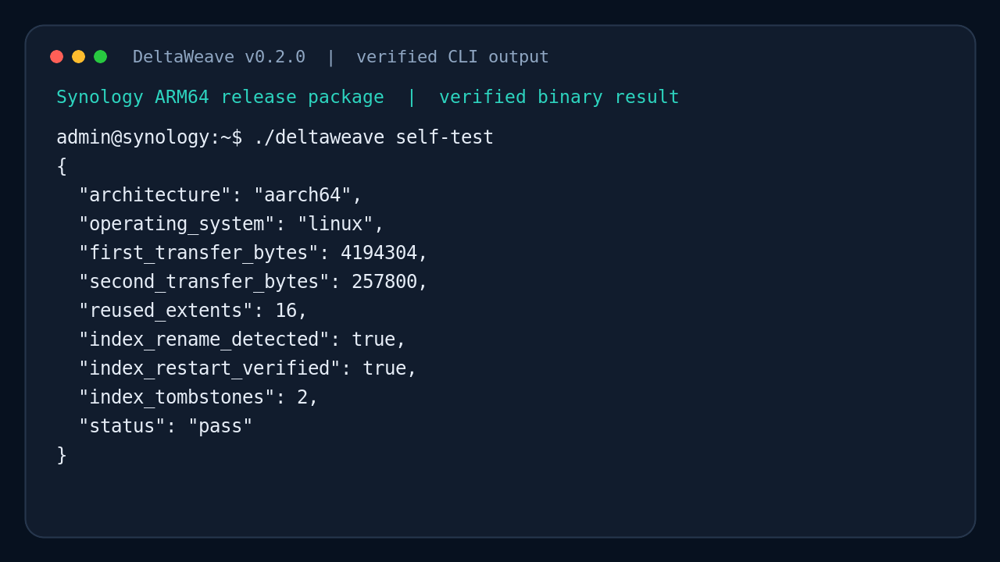
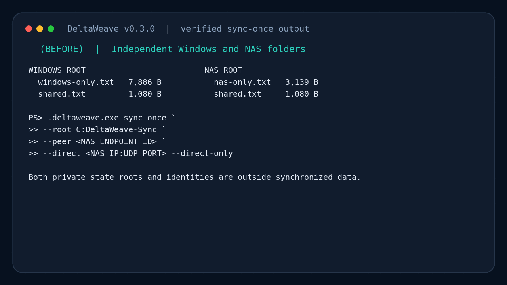

# Windows PC ↔ Synology DSM 릴리즈 테스트

이 문서는 DeltaWeave v0.3.0 바이너리의 Windows PC↔Synology 양방향 폴더
동기화를 검증하는 절차입니다. v0.3.0은 Merkle/버전 벡터 기반 pre-alpha
field preview이며, 중요한 데이터의 유일한 사본으로 사용하면 안 됩니다.

## 실제 실행 화면: 전·중·후·결과

아래 화면은 Windows 릴리스 바이너리의 실제 peer 접속 로그와 `self-test` 결과를
문서용 터미널로 재현한 것이다. 화면의 값은 예시로 만든 성공값이 아니라 릴리스
검증에서 얻은 값이다.



각 단계의 큰 정적 화면과 Synology ARM64 결과는
[실제 사용 화면 갤러리](USAGE_GALLERY.md)에서 확인한다.

## 1. 패키지 선택

Windows PC에서는 다음 파일을 받습니다.

- `DeltaWeave-v0.3.0-windows-x86_64.zip`

Synology에 SSH로 접속하고 CPU 아키텍처를 확인합니다.

```bash
uname -m
```

| 출력 | 받을 패키지 |
| --- | --- |
| `x86_64` | `DeltaWeave-v0.3.0-synology-x86_64.tar.gz` |
| `aarch64` | `DeltaWeave-v0.3.0-synology-aarch64.tar.gz` |
| `armv7l` 등 | v0.3.0 미지원 |

모든 파일은 [GitHub Releases](https://github.com/happyaspic-byte/DeltaWeave/releases/tag/v0.3.0)에서
다운로드합니다.

## 2. 다운로드 무결성 확인

릴리즈의 `SHA256SUMS.txt`에서 각 파일의 해시를 확인합니다.

Windows PowerShell:

```powershell
Get-FileHash .\DeltaWeave-v0.3.0-windows-x86_64.zip -Algorithm SHA256
```

Synology SSH:

```bash
sha256sum DeltaWeave-v0.3.0-synology-*.tar.gz
```

계산된 값이 `SHA256SUMS.txt`와 정확히 같아야 합니다.

## 3. 압축 해제와 장비별 self-test

Windows PowerShell:

```powershell
Expand-Archive .\DeltaWeave-v0.3.0-windows-x86_64.zip -DestinationPath C:\DeltaWeave
cd C:\DeltaWeave
.\deltaweave.exe self-test
```

Synology SSH에서는 NAS 아키텍처에 맞는 파일명을 사용합니다.

```bash
mkdir -p /volume1/DeltaWeave
tar --no-same-owner -xzf DeltaWeave-v0.3.0-synology-x86_64.tar.gz \
  -C /volume1/DeltaWeave --strip-components=1
cd /volume1/DeltaWeave
chmod 755 ./deltaweave
./deltaweave self-test
```

두 장비 모두 아래 항목을 포함한 JSON을 출력해야 합니다.

```json
{
  "index_rename_detected": true,
  "index_restart_verified": true,
  "sync_bidirectional_verified": true,
  "sync_conflicts_preserved": 1,
  "sync_delete_verified": true,
  "sync_restart_actions": 0,
  "status": "pass",
  "reused_extents": 16,
  "second_transfer_bytes": 257800
}
```

수치는 장비와 청킹 결과에 따라 달라지며 `status`가 `pass`,
`reused_extents`가 0보다 크고 index/sync 검증 값이 위와 같으면 성공입니다.

Windows 실제 결과:


Synology ARM64 실제 결과:



## 4. Windows 송신자 키 생성

Windows PowerShell에서 실행합니다.

```powershell
cd C:\DeltaWeave
.\deltaweave.exe init --identity .\sender.key
```

출력된 Windows 송신자의 `endpoint_id`를 복사합니다. `sender.key`는 비밀키이므로
공유하거나 Git에 올리면 안 됩니다.

## 5. Synology 수신기 실행

Windows에서 복사한 ID를 `<WINDOWS_ENDPOINT_ID>`에 넣습니다.

```bash
cd /volume1/DeltaWeave
mkdir -p received state
./deltaweave init --identity ./receiver.key
./deltaweave serve \
  --root ./received \
  --state ./state \
  --identity ./receiver.key \
  --allow-peer <WINDOWS_ENDPOINT_ID> \
  --direct-only
```

수신기 출력에서 다음 값을 복사합니다.

- Synology `endpoint_id`
- Windows에서 접근 가능한 `direct_addresses`의 `IP:UDP_PORT`

같은 LAN이면 Synology LAN IP를, Tailscale을 사용하면 Synology Tailscale IP가
포함된 주소를 선택합니다. DSM 방화벽을 사용한다면 출력된 UDP 포트를 허용합니다.

## 6. Windows에서 실제 파일 전송

10 MB 이상의 테스트용 로그, ISO 복사본 또는 임시 파일을 권장합니다.

```powershell
.\deltaweave.exe push C:\Test\sample.bin `
  --remote-path validation/sample.bin `
  --peer <SYNOLOGY_ENDPOINT_ID> `
  --direct <SYNOLOGY_IP:UDP_PORT> `
  --identity .\sender.key `
  --direct-only
```

성공하면 Synology의 다음 위치에 파일이 생성됩니다.

```text
/volume1/DeltaWeave/received/validation/sample.bin
```

## 7. 양쪽 파일 해시 확인

Windows PowerShell:

```powershell
Get-FileHash C:\Test\sample.bin -Algorithm SHA256
```

Synology SSH:

```bash
sha256sum /volume1/DeltaWeave/received/validation/sample.bin
```

두 SHA-256 값이 같아야 합니다.

## 8. 델타 재전송 확인

테스트 파일에 소량의 데이터를 추가하고 같은 `push` 명령을 다시 실행합니다.

```powershell
[IO.File]::AppendAllText("C:\Test\sample.bin", "DeltaWeave delta test")
```

두 번째 전송 결과에서 다음을 확인합니다.

- `reused_extents`가 0보다 큼
- `transferred_bytes`가 전체 파일 크기보다 작음
- 변경 후 Windows와 Synology 파일의 SHA-256이 다시 동일함

## 9. 실제 양방향 폴더 동기화

아래 검증은 기존 `push`와 별개로 NAS→Windows, 동시 수정, 삭제, 무변경 재실행까지
확인합니다. private state와 identity는 동기화 root 밖에 둡니다.

Windows PowerShell:

```powershell
New-Item -ItemType Directory -Force C:\DeltaWeave-Sync | Out-Null
New-Item -ItemType Directory -Force C:\DeltaWeave-Private | Out-Null
Set-Content C:\DeltaWeave-Sync\windows-only.txt "from Windows"

.\deltaweave.exe sync-once `
  --root C:\DeltaWeave-Sync `
  --state C:\DeltaWeave-Private\state `
  --identity .\sender.key `
  --peer <SYNOLOGY_ENDPOINT_ID> `
  --direct <SYNOLOGY_IP:UDP_PORT> `
  --direct-only
```

Synology의 `serve --root` 아래에 NAS 전용 파일을 만든 뒤 같은 명령을 다시 실행합니다.

```bash
printf '%s\n' 'from Synology' > /volume1/DeltaWeave/received/nas-only.txt
```

두 번째 실행 후 다음을 확인합니다.

- Windows에 `nas-only.txt`, Synology에 `windows-only.txt`가 모두 존재한다.
- JSON의 `status`가 `pass`다.
- `desired_root`, `verified_local_root`, `verified_remote_root`가 정확히 같다.

동시 수정 테스트는 복사본 파일로만 수행합니다. 먼저 양쪽에 같은 `shared.txt`를 만들고
한 번 동기화한 뒤, 네트워크를 끊거나 다음 sync 전 양쪽 내용을 서로 다르게 수정합니다.
다시 `sync-once`를 실행하면 JSON `conflicts`에 원본 경로와
`shared.conflict-<hash>.txt`가 하나 기록되어야 하며 두 장비에 두 파일의 BLAKE3
내용 집합이 같아야 합니다.

삭제 전파는 Windows에서 `windows-only.txt`를 삭제하고 다시 실행해 확인합니다.
NAS 파일이 사라지고 JSON이 `pass`여야 합니다. 바로 한 번 더 실행했을 때는 다음
무변경 fast path가 정상입니다.

```json
{
  "merkle_queries": 1,
  "local_actions": 0,
  "remote_actions": 0,
  "pulled_bytes": 0,
  "pushed_bytes": 0,
  "status": "pass"
}
```

장기 시험은 `sync-once` 대신 같은 인자의 `sync --interval-seconds 5`를 사용합니다.
Windows 로컬 변경은 native watcher가 기본 750ms quiet window 뒤 즉시 깨우고,
NAS에서만 발생한 변경은 최대 5초 안에 폴링으로 발견합니다. 시작 JSON의
`local_change_detection`이 `native_watcher`인지 확인합니다. watcher를 열지 못하면
`polling_fallback`과 `watcher_error`가 출력되지만 동기화는 계속됩니다. 일시 오류는
최대 300초 지수 백오프로 재시도하며 `Ctrl+C`로 안전 종료합니다.



## 10. 문제 해결

| 증상 | 확인 사항 |
| --- | --- |
| `Permission denied` | Synology에서 `chmod 755 ./deltaweave` 실행 |
| `cannot execute binary file` | `uname -m`과 패키지 아키텍처가 일치하는지 확인 |
| 피어 거부 | Synology의 `--allow-peer`에 Windows 송신자 ID를 넣었는지 확인 |
| 연결 실패 | IP 도달성, Windows/DSM 방화벽, 출력된 UDP 포트 확인 |
| 키 권한 오류 | Synology에서 `chmod 600 sender.key receiver.key` 실행 |
| `scan is incomplete` | 잠긴/변경 중인 파일을 닫고 retry 시간이 지난 뒤 다시 실행 |
| `path collision` | 대소문자·Unicode 정규화 후 같은 이름이 되는 파일을 수동 변경 |
| `causally stale` | 양쪽 최신 상태를 `sync-once`로 다시 병합하고 오래된 자동화 중지 |

테스트 종료는 Synology 수신기 터미널에서 `Ctrl+C`를 누릅니다. v0.3.0에는
검증형 양방향 폴더 동기화가 포함되지만 DSM SPK, Windows 서비스/설치 프로그램,
symlink materialization 또는 VFS는 포함되지 않습니다. 로컬 인덱스는
[별도 검증 절차](TESTING_LOCAL_INDEX.md)를 따릅니다.
