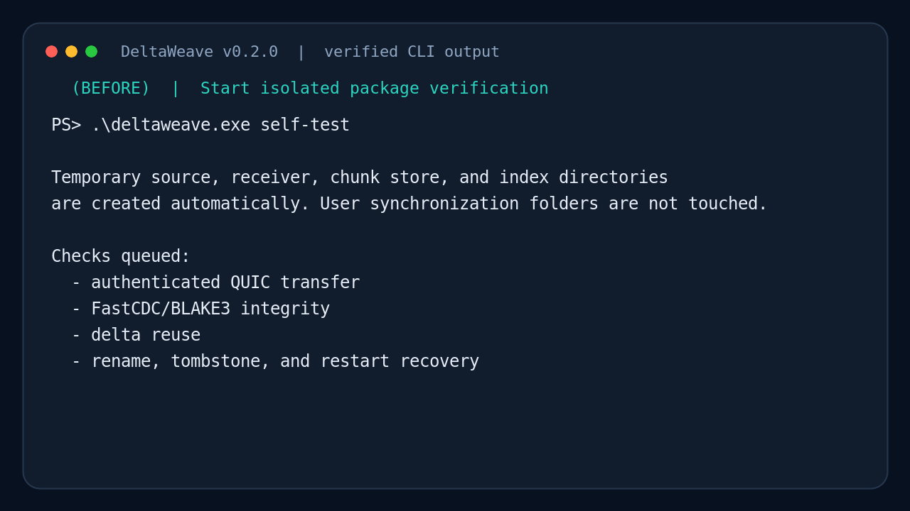
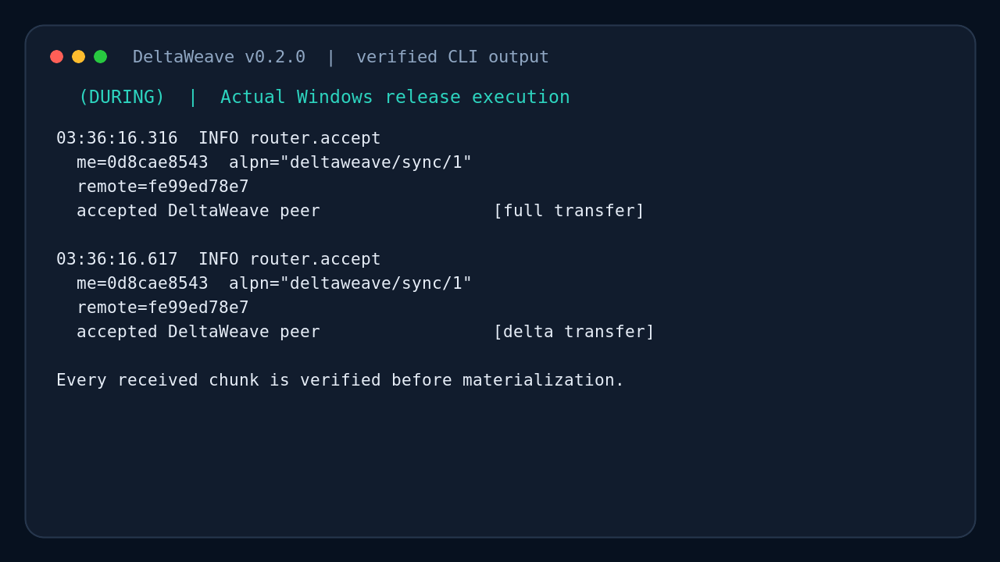
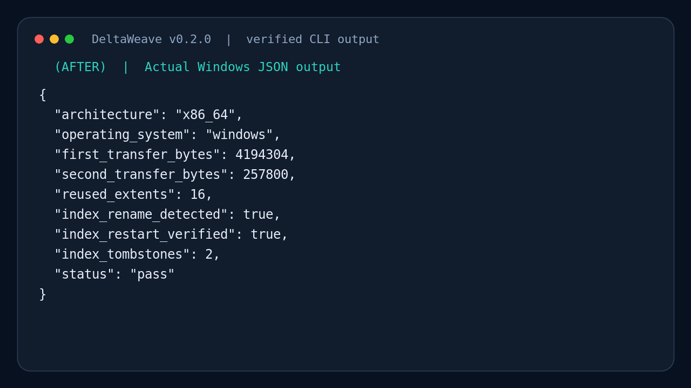
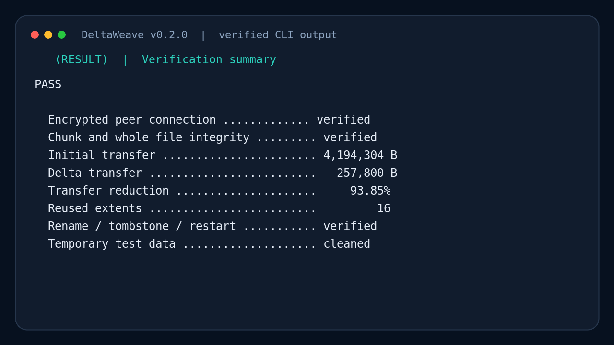
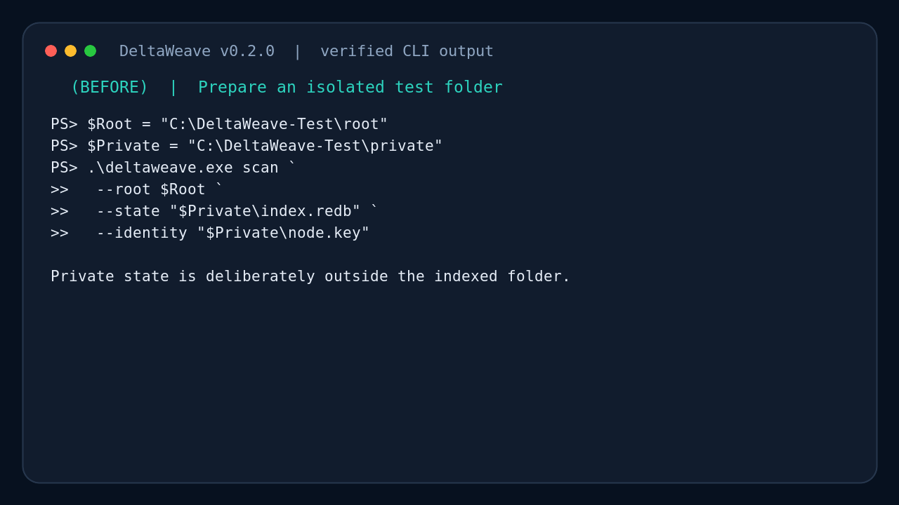
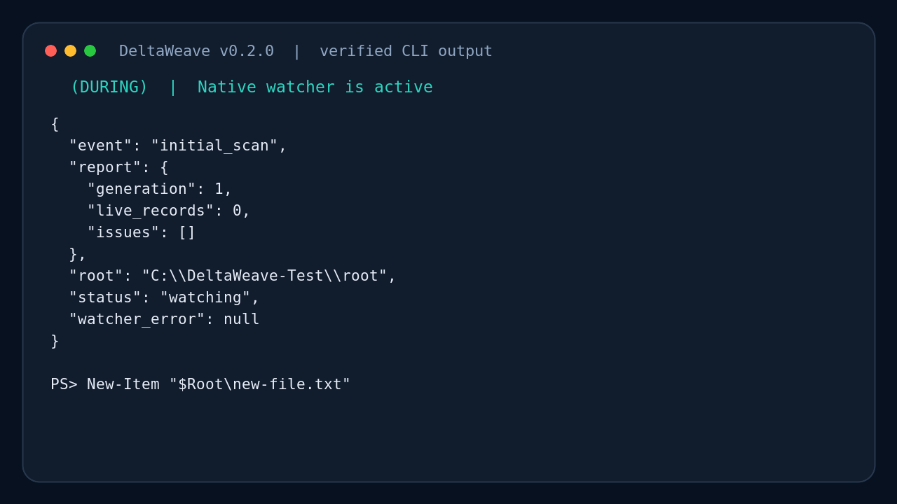
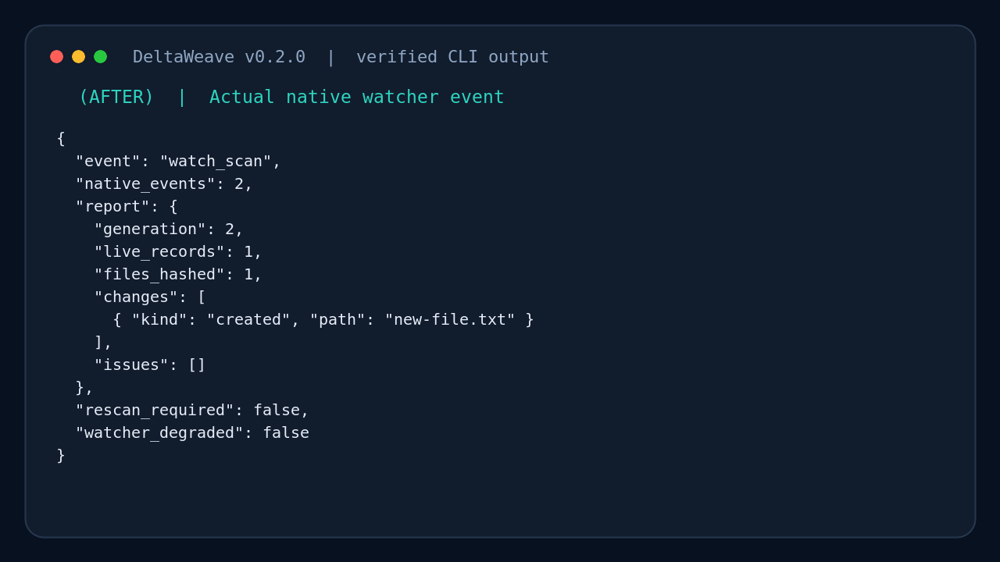
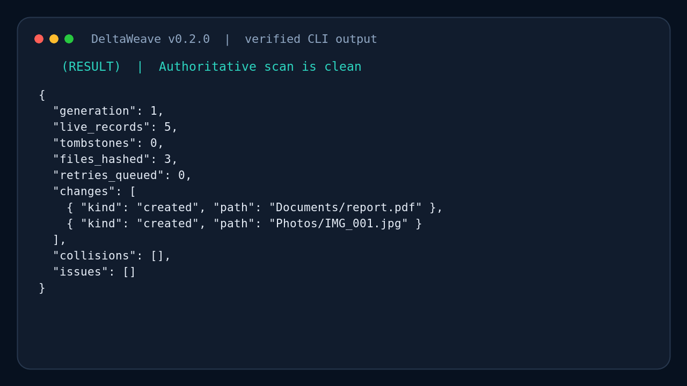

# DeltaWeave 실제 사용 화면

이 문서는 DeltaWeave를 실행했을 때 보이는 화면을 **전·중·후·결과** 순서로
보여 준다. 터미널의 배경과 글꼴만 문서용으로 통일했으며 다음 데이터는 실제
v0.2.0 검증 실행에서 가져왔다.

- Windows x86-64 릴리스 바이너리의 peer 접속 로그와 `self-test` JSON
- Synology/Linux ARM64 릴리스 바이너리의 `self-test` JSON
- 실제 세 파일 authoritative scan 결과
- 실제 native watcher가 새 파일을 감지한 이벤트

endpoint ID는 테스트 때 생성된 일회성 ID의 짧은 표시값만 사용한다. 실제 사용자
파일, 비밀키, 운영 NAS 주소는 포함하지 않는다.

## 1. Windows 패키지 자체 검증

### 전: 격리된 자체 테스트 시작

사용자 동기화 폴더를 건드리지 않고 임시 송신자·수신자·인덱스를 준비한다.

### 중: 두 번의 인증된 peer 연결

첫 연결은 전체 파일을 전송하고 두 번째 연결은 변경 후 누락된 청크만 전송한다.

### 후: Windows JSON 출력

`status=pass`, rename 감지, tombstone 생성, DB 재시작 복구를 확인한다.

### 결과: 합격 판정

이 검증에서는 첫 전송 4,194,304바이트 대비 두 번째 전송이 257,800바이트였고,
16개 extent를 재사용했다.

## 2. 로컬 인덱스와 watcher

### 전: 시험 폴더와 private state 분리

### 중: native watcher 활성화

### 후: 새 파일 이벤트 감지

### 결과: authoritative scan 확인

정상 결과는 `issues=[]`, `collisions=[]`, `retries_queued=0`이며 watcher 화면의
`watcher_degraded=false`도 확인한다.

## 3. Synology ARM64 패키지

이 화면은 릴리스 워크플로가 ARM64 정적 바이너리를 QEMU에서 직접 실행한 결과다.
실제 NAS에서는 SSH 터미널에서 같은 `./deltaweave self-test` 명령을 사용한다.

## 4. Portainer 배포 흐름

구체적인 변수, 영속 볼륨, 보안 게이트는
[Portainer AI 설치 실행서](AI_PORTAINER_SETUP.md)를 따른다.
