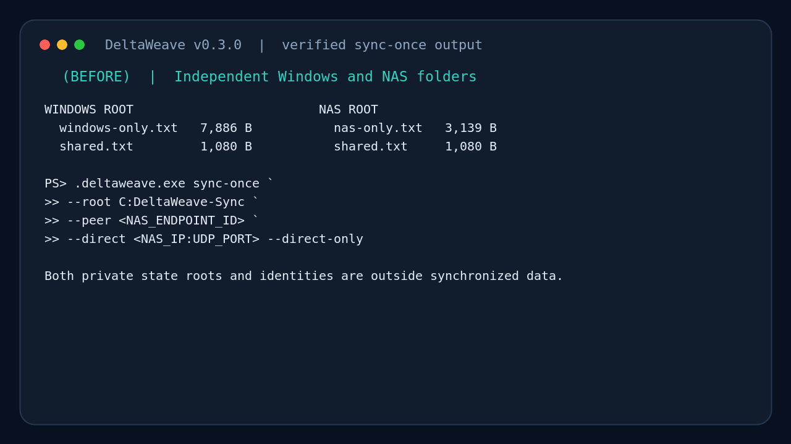
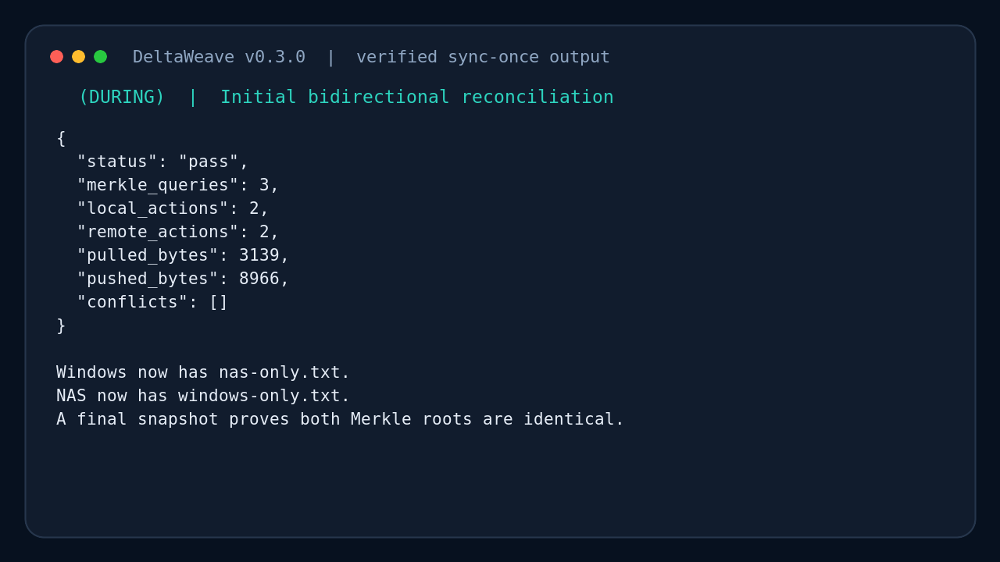
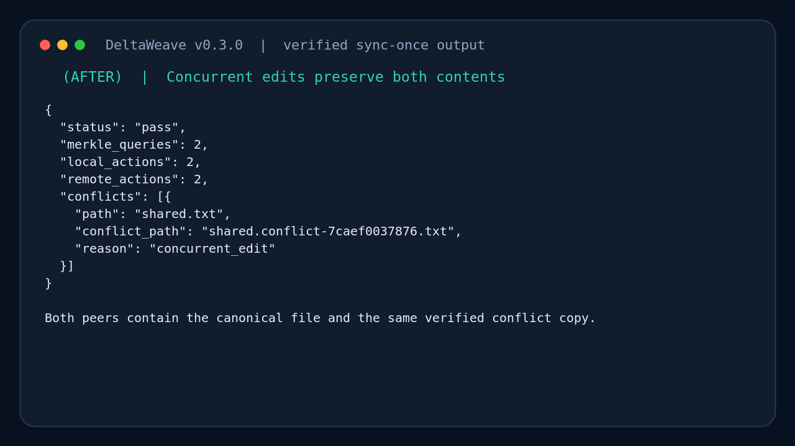
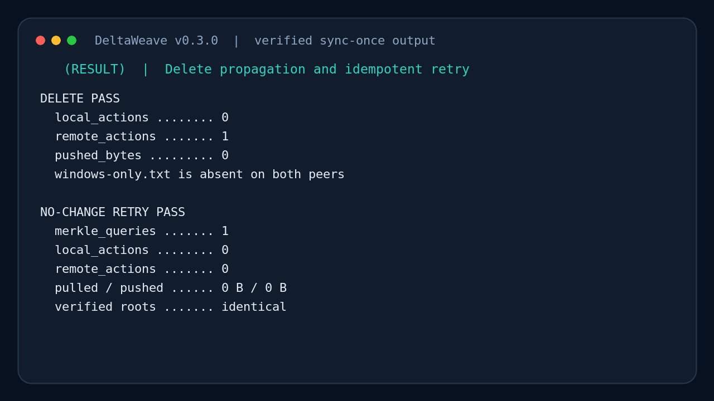

# DeltaWeave 사용 화면 갤러리

이 문서는 과거 DeltaWeave 실행 예시를 **전·중·후·결과** 순서로 보여 준다.
터미널 이미지는 `scripts/render-doc-visuals.sh`에 고정된 출력 발췌와 설명을
렌더링한 것이다. 생성기에는 v0.2.0 패키지 및 로컬 인덱스 실행값,
v0.3.0 `sync-once` 실행값으로 기록되어 있다. 생성기는 CLI를 실행하거나
새 결과를 수집하지 않으므로 이미지를 재생성해도 현재 버전의 검증 증거가 되지 않는다.

- v0.2.0 Windows x86-64 패키지의 peer 접속 로그와 `self-test` JSON 발췌
- v0.2.0 Linux ARM64 패키지의 QEMU `self-test` JSON 발췌
- v0.2.0 세 파일 authoritative scan과 별도 native watcher 이벤트 예시
- v0.3.0 `sync-once`의 양방향 병합·동시 수정·삭제·무변경 재시도 JSON 발췌

현재 저장소 버전은 v0.4.0이다. 아래 이미지의 JSON은 전체 출력 스키마가 아니며,
현재 패키지의 Windows/DSM 실행을 이번 문서 수정에서 재검증한 결과도 아니다.
릴리스 아카이브의 `TESTING.md` 또는 다음 저장소 안내를 사용한다.
현재 명령과 합격 기준은 [Windows/Synology 검증 안내](https://github.com/happyaspic-byte/DeltaWeave/blob/main/docs/TESTING_WINDOWS_SYNOLOGY.md)와
[로컬 인덱스 검증 안내](TESTING_LOCAL_INDEX.md)를 따른다.

endpoint ID는 테스트 때 생성된 일회성 ID의 짧은 표시값만 사용한다. 실제 사용자
파일, 비밀키, 운영 NAS 주소는 포함하지 않는다.

## 1. v0.2.0 Windows 패키지 자체 검증 예시

### 전: 격리된 자체 테스트 시작

사용자 동기화 폴더를 건드리지 않고 임시 송신자·수신자·인덱스를 준비한다.

### 중: 두 번의 인증된 peer 연결

이 발췌에서 첫 연결은 전체 파일을 전송하고 두 번째 연결은 변경 후 누락된 청크만
전송한다. 현재 `self-test`는 이후 양방향 동기화도 검사하므로 두 연결만으로
끝나는 전체 실행 로그로 해석하지 않는다.

### 후: Windows JSON 출력

`status=pass`, rename 감지, tombstone 생성, DB 재시작 복구를 확인한다.

### 결과: 합격 판정

기록된 v0.2.0 예시에서는 첫 전송 4,194,304바이트 대비 두 번째 전송이
257,800바이트였고, 16개 extent를 재사용했다. 이 값은 일반 파일의 전송 절감률이나
현재 장비의 성능 측정값을 뜻하지 않는다.

## 2. v0.3.0 양방향 폴더 동기화 예시

### 전: 서로 다른 Windows/NAS 파일

### 중: 최초 양방향 병합과 루트 검증

### 후: 양쪽 동시 수정과 conflict copy

### 결과: 삭제 전파와 0-action 재실행

생성기에는 두 독립 루트와 영속 키를 사용한 v0.3.0 direct-only CLI 실행값으로
기록되어 있다. Windows/NAS 표시는 두 루트의 역할을 설명하며 물리 장비 간
시험을 입증하지 않는다. 마지막 발췌의 `merkle_queries=1`, 양쪽 action 0,
전송 0바이트는 해당 예시 값이다. 첫 화면의 명령은 축약되어 있으므로 실제
실행에는 검증 안내의 명시적인 `--state`·`--identity` 경로를 사용한다.

## 3. v0.2.0 로컬 인덱스와 watcher 예시

### 전: 시험 폴더와 private state 분리

### 중: native watcher 활성화

### 후: 새 파일 이벤트 감지

### 결과: authoritative scan 확인

이 깨끗한 시험 데이터에서는 `issues=[]`, `collisions=[]`, `retries_queued=0`과
`watcher_degraded=false`가 기록되어 있다. watcher 화면과 세 파일 전체 스캔은
별도 실행이므로 generation과 항목 수가 이어지지 않는다. 실제 충돌이나 watcher
폴백 시험의 기대 결과는 로컬 인덱스 검증 안내에서 확인한다.

## 4. v0.2.0 Linux ARM64 패키지 예시

이 화면은 v0.2.0 ARM64 정적 바이너리의 QEMU 실행값으로 기록된 발췌다.
`admin@synology` 프롬프트는 문서용 표현이며 실제 DSM 실행 증거가 아니다.
현재 릴리스 워크플로도 두 Linux 아키텍처의 패키지 바이너리에 `self-test`를
실행하도록 설정되어 있다. 실제 NAS에서는 SSH 터미널에서 같은
`./deltaweave self-test` 명령을 사용해 별도로 검증한다.

## 5. Portainer 배포 흐름

구체적인 변수, 영속 볼륨, 보안 게이트는
[Portainer AI 설치 실행서](AI_PORTAINER_SETUP.md)를 따른다.
